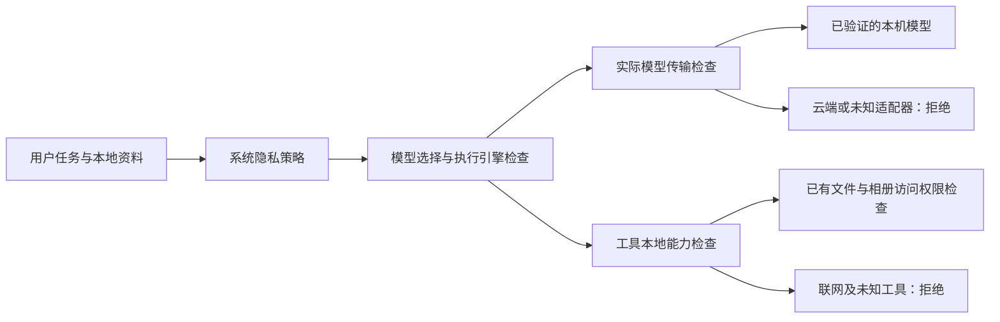

# NAS 与 Agent 的隐私边界

2026-09-07。本文描述本仓库已实现的应用层限制。NAS 文件仍保存在本地，不代表使用云端模型时文件内容不会进入请求上下文。

## 一个策略，两个模式

`GET/POST /api/ai-mode` 是唯一的系统模式来源；只有管理员可以修改。系统设置与本地数据库使用同一个接口，保存成功后才更新显示。数据库原来的独立策略写入口返回 409，读取入口投影系统策略。

| 行为 | 隐私模式 | 效率模式 |
| --- | --- | --- |
| 模型推理 | 只允许已验证的本机 HTTP 适配器 | 允许所选云端或本机服务 |
| 本机模型不可用 | 停止并显示原因 | 保留已有路由与回退规则 |
| 显式选择云端模型 | 在发送前拒绝 | 按配置执行 |
| Codex / ChatGPT 订阅 | 拒绝新任务；关闭已运行的 Codex 会话 | 按现有授权执行 |
| 工具 | 只开放标记并审核过的内置本地工具 | 继续适用原有审批、路径权限与沙箱 |
| 命令、浏览器、MCP、未验证插件 | 拒绝 Agent 调用 | 按原有授权执行 |
| 文档检索、数据库分析 | 本机服务确认策略与模型配置后执行 | 先同步效率策略再执行 |
| 模型自动下载、额外视觉服务 | 缺少本机缓存时停止，不转用云端 | 按原有配置执行 |

全新安装仍沿用原有的效率模式默认值；本次更新不会悄悄改变现有用户的模式。已有策略损坏、无法读取或环境变量取值无效时，按隐私模式限制。策略通过原子写入保存；写入失败返回错误，不显示成功。

## 请求如何受控

“本机”按实际地址判断：仅接受合法的 `localhost`、IPv4/IPv6 回环地址。局域网地址、云端地址、伪装域名和带转发参数的地址都不在当前允许范围内。支持本机 Ollama、OpenAI 兼容 Chat Completions 和 Responses 协议；自定义模型目录的具体条目会解析到实际适配器再检查。同名模型不会借用另一个服务的本地属性。

本机模型请求不使用环境代理，也不跟随重定向。路由选择、实际请求发送和兼容重试分别检查策略，隐私模式下不会自动切换到备用云服务。辅助图片转述与远端 embedding 同样受限。照片/向量模型只使用已有本机缓存，首次使用时缺少权重会明确失败。

内置文件读取、文件搜索、文本处理、已授权相册工具及文档检索有明确的本地能力标记。第三方工具默认拒绝；模型生成的参数和“跳过审批”选项不能设置或覆盖这个标记。原有 NAS 用户权限、路径限制和照片库授权继续生效。

## 独立数据库服务

`echo-storage` 是独立服务。本仓库的网关和 Agent 检索工具在每次计算前同步系统策略。隐私模式下，还要求该服务确认禁止云端回答/片段导出，并检查其模型目录中的实际端点；未确认、远端模型或未知响应都会阻止本次计算。已知的文件浏览与元数据读取仍可使用，未知 GET 路由也按计算操作检查。

数据库服务本身、其进程内模型以及用户安装的回环服务属于受信任的部署组件。当前代码无法证明它们没有自行转发请求，也不能保证撤销它们在模式切换前已启动的后台任务。部署方必须使用本机权重、关闭第三方云端回退；需要整机不出网时，应另外采用操作系统网络隔离，并覆盖数据库、模型服务、插件及其子进程。Agent 的模式开关不等同于防火墙。

## 使用与边界

1. 先准备本机模型权重，在模型设置中配置回环端点，并确认本机推理可用。
2. 在系统设置的“个人空间与安全 → AI 模式”选择隐私模式。本地数据库入口显示同一策略。
3. 无可用本机模型、缓存不全或工具未验证时，修正配置后重试，不会自动转用云端。

切回效率模式后，任务描述、读取的文件内容、检索片段及历史上下文可能发送给所选模型服务。当前不是逐文件授权或完整内容脱敏系统；数据库的片段长度/路径处理策略也不能替代所有 Agent 工具结果的脱敏。界面会说明云端模式的这个含义。

切换模式不能收回此前已经发送的数据。Codex 会话有策略监视器负责关闭，其他模型在新的发送及重试边界检查；已在途的 HTTP 请求不承诺同步撤回。桌面浏览器、消息渠道和其他独立应用的联网行为也不受这个 AI 模式全面管理。

## 验证

`tests/test_privacy_boundary.py` 使用合成的 `PRIVATE-CANARY` 与模拟 HTTP 传输，验证外部端点未收到私密请求、本机模型仍可成功调用、目录条目正确解析、重定向/代理拒绝、显式模型与 Codex 不绕过策略、模式切换阻止重试、数据库先确认策略以及持久化失败保留旧策略。测试不向真实云服务发送资料。

前端测试覆盖保存确认、失败与无效响应、两处入口共用接口，以及旧的异步状态响应不覆盖新模式。独立 `echo-storage` 的内部实现与实机网络隔离不在这些模拟测试的证明范围内。

本次联合回归：300 项后端测试通过，1 项因未安装 Anthropic SDK 跳过；前端 4 个测试文件、28 项测试通过；TypeScript 检查、Ruff 检查和生产构建通过。另行运行的订阅路由测试中，原有 `test_credentials_must_be_private_and_are_never_returned_as_public_metadata` 在 Windows 上因 POSIX 文件权限位假设而失败，该权限读取实现未在本次改动中修改。

开发服务已重启并核验 `/api/ai-mode` 返回新的模式说明。当前保留效率模式；本机模型检测结果为不可用。浏览器端停在设备登录界面，本次没有修改账号或代替用户选择模式，也没有把组件测试当作已登录后的实机操作验收。
