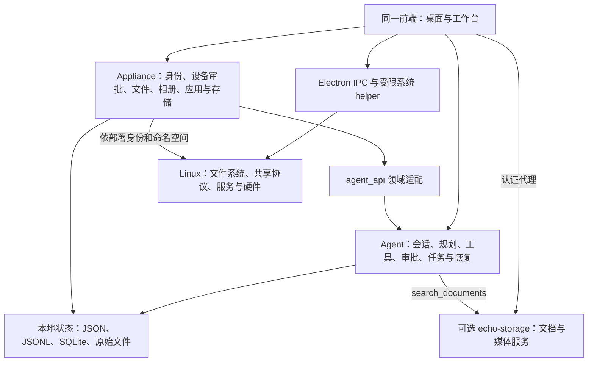

# Echo OS 深度核验：架构、产品边界与优化依据

核验日期：2026-09-05。最初架构核验源码基准为 `829fcf4b587ec3305b2e7119d2a91d8eab8a20fb`，同时检查当时未提交工作区。本轮重新沿源码只读核验，开始 HEAD 为 `f9b3dd8`，结束记录为 `88f837089af2594ab9a9c30c52d6c9f9c2b0a1a8`；差异与当前判断补充在第九部分。后续文本回滚和桌面整理的实现进展单列在[验证记录](DOCUMENT_ROLLBACK_VERIFICATION_2026-09-05.md)，不能混用源码快照。该工作区包含本任务的打磨和另一任务的存储修改，不能代表已经发布的版本。本次沿入口、装配、权限、执行、数据、恢复追踪核心链路，并用三份独立只读复核交叉检查；没有逐行读完全部源码，没有进行竞品上机横评，也没有重新验证所有 Linux 镜像和物理设备。

**修正后的判断**

Echo OS 有自己的 Agent 执行运行时、本地持久数据、照片算法、设备服务、应用交付和 Linux 安装更新链。称为“基于 Debian、面向个人设备与私有数据的 Agent OS”有实现依据。它同时覆盖个人工作台和 NAS appliance，不能用“有没有聊天窗口”“有没有数据库”评价其架构。

当前最需要核实的是跨层的一致性：同一用户在不同入口是否访问同一份授权数据；计划描述的操作是否确实经过对应 provider；任务状态能否关联实际写入；恢复后凭据、数据库、原件和系统挂载是否仍然一致。已有模块不少，但不能因此直接宣称这些关系全部成立。

这里的 runtime `Kernel` 是 Agent 的装配门面。Linux 仍承担内核、驱动和进程等基础职责；Linux 发行、桌面应用、Agent 运行时是不同层次。若“算力 OS”特指跨节点 GPU 发现、分配、配额与故障迁移，现有证据不足以支持这种交付定位。

**一、架构应这样理解**

单仓和统一安装包并不消除模块边界。`appliance/agent_api` 将设备层对 runtime 的调用约束为领域接口，启动探针检查必需符号，AST 测试阻止设备功能任意依赖 runtime 私有模块。这是已有工程约束，值得保留。[边界与契约](C:/飞牛os/octopus-os/docs/AGENT_OS_BOUNDARY.md)、[装配入口](C:/飞牛os/octopus-os/runtime/platform/config/builder.py:98)

**二、本地数据库和相册确实存在，而且有明确分工**

| 数据类别 | 已有实现 | 正确理解 |
| --- | --- | --- |
| 个人记忆 | 按租户/用户保存事实 JSON、Markdown；MemoryHub 聚合后进入提示词 | Agent 有本地记忆，MemoryHub 当前是读取聚合层，不是一张统一写入数据库 |
| 对话、任务和执行证据 | 线程 JSONL、`task_runs.json`、`tool_effects.sqlite3`；持久 journal 配置下还绑定 trace/checkpoint SQLite | 保存聊天、保存执行状态、保证外部副作用可恢复是三个不同问题 |
| 协作与业务 | 组织、ProjectOS、Cowork、控制会话、房间消息、邀请、工作区挂载各有 SQLite | 多库分工本身合理；要定义关联备份、成员授权和恢复顺序 |
| 图片智能索引 | 原有 SQLite 保存 CLIP 向量、人脸、元数据、标签、OCR、感知哈希、质量、类别原型 | 原图在文件系统，数据库是索引和管理数据；只备份数据库不等于备份照片 |
| 设备业务 | 手机同步 SQLite；Hub 安装/启停操作 SQLite；本轮相册任务日志 | 属于各 provider 的业务状态，不应误称为全部由 Agent 同一任务队列执行 |
| 文件管家 | 本仓的 UI/Agent 调用可选 `echo-storage` 服务 | 本仓可以证明客户端接线，不能据此推断外部服务内部数据库和完整授权实现 |

记忆实际进入提示词的链路为 [MemoryHub](C:/飞牛os/octopus-os/runtime/memory/runtime_state/hub.py:46) → [prompt assembly](C:/飞牛os/octopus-os/runtime/core/cerebrum/_react_prompt_assembly_state.py:168)。任务与 trace 的装配条件见 [AppState](C:/飞牛os/octopus-os/runtime/platform/ui/state.py:61)；业务库位置和关联见[已有逐库核验](C:/飞牛os/octopus-os/docs/PROJECT_REVIEW_2026-09-05.md:31)。因此，`journal=null` 不能被解释成所有状态都只在内存。

原有图像引擎有 **8 张表和 12 个已注册图片工具**。当前工作区新增人物持久命名、索引设置、内容指纹、人脸来源后为 **12 张表**。这些新增不能倒算为原有能力，但原有相册也不能被抹掉。[建表与查询](C:/飞牛os/octopus-os/runtime/memory/hemolymph/image_semantic_index.py:201)、[原有工具注册](C:/飞牛os/octopus-os/runtime/execution/suckers/builtins.py:783)

原有工具已经覆盖建索引、文字搜图、以图搜图、人脸分组/检索，以及分类、OCR、重复/模糊检测、敏感内容检测、元数据筛选和类别训练；当前新增人物命名工具需单列。另一方面，表存在不代表自动填充：本次未找到 `image_tags` 的实际写入方，设备相册搜索也不是 OCR 全文检索。因此“有这些算法”与“桌面已有完整人物/标签管理流程”仍需区分。

照片之外，规划器还装配 `planner_kg.db`，代码和视频也有各自索引；视频 schema 含关键帧、人脸、字幕和标签。以上是源码能力，未据此声称所有编码器和业务流程已实测通过。[规划知识图谱装配](C:/飞牛os/octopus-os/runtime/platform/config/builder.py:214)、[视频索引](C:/飞牛os/octopus-os/runtime/memory/hemolymph/video_semantic_index.py:114)

照片链路需要区分三个入口：

| 入口 | 实际后端 | 当前边界 |
| --- | --- | --- |
| 设备“照片”面板 | `PhotoLibraryService → AgentImageIndexAdapter → runtime 图像引擎`，设备状态目录的 `media/image_index.db` | 原有浏览、原件和索引 API；本轮补强取消、提交恢复和空库清理 |
| Agent 通用 `image_* / face_*` | 同一图像算法，按调用目录选择另一个索引 | 共享算法不代表默认共享桌面那一库；原有 basename 库身份已在工作区修正 |
| “文件管家”媒体库 | `/api/storage/v1/* → echo-storage` | 外部服务的资源与权限合同需要独立核验，不能等同自有照片索引 |

甚至 `/apps/photos` 的 MediaAppPage 也调用外部 Storage；它和 `/desktop` 的 PhotosPanel 不是同一个后端入口。用户都把它们理解为“照片”时，产品必须解释库来源并保证选择一致，不能靠相同名称推断数据已经共享。[媒体应用](C:/飞牛os/octopus-os/frontend/src/app/apps/media/page.tsx:27)、[路由](C:/飞牛os/octopus-os/frontend/src/router.tsx:113)

本轮新增的四个 `photos_*` 工具绑定桌面的同一个服务和账户授权，使 Agent 可以读设备相册、检索、看状态和预览计划。**`photos_index_plan` 只生成预览，启动索引仍走照片面板的单次审批**；没有证明 Agent 已接完全部相册写操作。[工具接线](C:/飞牛os/octopus-os/appliance/photo_tools.py:125)

手机上传会通知相册扫描失效，但上传完成不等于向量编码完成；OCR 也有独立工具，不应因为存在 `image_ocr` 表就声称全部入库照片已有 OCR。[同步路径](C:/飞牛os/octopus-os/appliance/sync.py:291)、[图片工具](C:/飞牛os/octopus-os/runtime/execution/suckers/image_album_skills.py:161)

这部分优化应复用现有引擎，统一库身份、原件来源和权限消费；没有依据重建另一套相册或把不同职责数据库硬合并。

**三、Agent 执行有真实内核，但“所有应用自动贯通”仍需证明**

常见 ReAct 路径是：请求凭证 → 服务端 actor/tenant 与 workspace → Session/journal 上下文 → ReAct → ToolExecutor → 策略、作用域、审批和副作用回执 → handler → 结果与任务投影。另有 Codex/native tool loop 等分支，应分别验证。[可信会话](C:/飞牛os/octopus-os/runtime/sensing/gateway/_realtime_gateway_session.py:440)、[执行上下文](C:/飞牛os/octopus-os/runtime/sensing/gateway/_realtime_react_stream_drive.py:585)、[执行器](C:/飞牛os/octopus-os/runtime/execution/tool_engine/executor.py:435)

这证明 Agent 会实际调用工具并管理执行状态。通用任务由 TaskSupervisor 处理租约和生命周期，任务空间读取它的投影；但 Hub 的 `hub-operations.sqlite3` 与有界 worker、照片 job、ProjectOS 业务任务仍有各自职责。优化目标是将 task/intent 与 provider job/receipt 关联，使用户可以追溯一次请求的所有步骤，不是再造一个调度器，也不是强行抹去已有业务状态。[任务租约](C:/飞牛os/octopus-os/runtime/platform/process/task_supervisor.py:560)、[Hub 状态](C:/飞牛os/octopus-os/appliance/hub/operations.py:103)、[任务投影](C:/飞牛os/octopus-os/appliance/task_projection.py:352)

系统能力目录返回 provider、操作描述、风险和审批要求；`/decisions` 做预检，不是通用执行器。真正操作仍需调用各路由并满足各自授权。当前核验未找到一个普通 Agent 消费端将全部 OS capability 自动贯通，因此“目录列出了能力”不能等同“自然语言请求已经完成这项操作”。[能力路由](C:/飞牛os/octopus-os/appliance/capabilities/router.py:103)

工具回执能阻止部分重复执行，对已进入副作用但缺可靠完成证据的情况保留“不确定”。这比盲目重试有意义，但它不是任意 shell、文件系统和第三方 API 都严格只执行一次的证明。[回执决策](C:/飞牛os/octopus-os/runtime/execution/tool_engine/effect_receipts.py:299)

最具体的缺口例子是“整理发票后撤销”：已有文件读写、计划、产物和回滚账本，另有独立的 Desktop 按扩展名整理。最初发现的文本直接写回问题已在后续工作区改为有前置条件的原子发布，但通用 rename 回滚仍不支持，Desktop 整理也不是任意授权目录的发票流程。[文本实现与边界](DOCUMENT_ROLLBACK_VERIFICATION_2026-09-05.md) 后续另沿现有 NAS provider 实施了票据专用计划、审批与反向移动，见本文第十节；不能把这些不同链路混作一种通用撤销。

**四、不同安装方式实际是不同能力组合**

| 形态 | 原有实现与权限 | 不能自动继承的能力 |
| --- | --- | --- |
| Debian netinst / firstboot | 安装 ZFS、SMART、Samba/NFS 等；root 运行完整 appliance；nginx 对外 | 与 mkosi 不是同一安装更新路线，不能继承其 A/B 结论 |
| mkosi 原生镜像 | Debian、桌面会话、非 root Agent；默认 native 扩展；Electron IPC 操作网络、电源和更新 | native 扩展不自动挂载完整 NAS API；不是所有 Docker/root appliance 面板都可用 |
| Docker appliance | 完整设备扩展、降权进程、状态和 NAS bind；应用控制走受限代理 | 容器看到自己的命名空间，默认未装全套宿主存储工具、未授予宿主磁盘和账户管理能力 |
| 普通 Electron 安装包 | 打包 Python 后端、用户数据目录与桌面工作台 | 桌面应用安装不会自动接管主机启动、分区和磁盘生命周期 |

来源：[root 服务](C:/飞牛os/octopus-os/deploy/provision/base/echo-appliance.service:11)、[原生镜像服务](C:/飞牛os/octopus-os/deploy/agent/echo-agent.service:11)、[native 扩展](C:/飞牛os/octopus-os/appliance/native_extension.py:17)、[容器配置](C:/飞牛os/octopus-os/deploy/appliance/docker-compose.yml:129)、[Electron launcher](C:/飞牛os/octopus-os/frontend/electron/backend-runtime.cjs:620)。原生系统另有真实 [Electron 系统 IPC](C:/飞牛os/octopus-os/frontend/electron/main.cjs:774)，不能因为 native Python 扩展较窄就说系统没有设备控制。

`NativeStorageAuthority` 已成为默认存储权威，旧 `/api/appliance/omv/*` 是兼容路径；并非默认还依赖 OMV。共享、账户、ACL、SMB/NFS、配额和受限双盘 ZFS mirror 已有实际实现。最新重新核验的 HEAD 还包含受限故障成员换盘、scrub、Echo 布局池导入/导出，不能继续沿用最初快照“换盘未支持”的概括。它们有明确前置条件，不代表任意扩容、拓扑重构、销毁或损坏池强制恢复。[权威装配](C:/飞牛os/octopus-os/appliance/extension.py:286)、[存储池支持范围](C:/飞牛os/octopus-os/appliance/native_storage_pool.py:1)、[换盘执行](C:/飞牛os/octopus-os/appliance/native_storage_pool.py:805)

mkosi 路线有目标盘检查、镜像校验、A/B root、UKI、dm-verity、分离的数据分区及恢复脚本；容器升级则是不可变镜像、状态备份和容器回滚。两者都有工程实现，证据也应各自闭合。[安装器](C:/飞牛os/octopus-os/deploy/installer/echo-os-installer:127)、[系统更新器](C:/飞牛os/octopus-os/deploy/update/echo-os-update:307)、[容器升级器](C:/飞牛os/octopus-os/deploy/appliance/upgrade-appliance.sh:22)

这意味着最先应固定一个主要支持形态和参考机，并让界面按实际装配展示能力。给所有形态打一个“完成度”分数没有可靠意义。

**五、应用生态与算力也要按实际接线理解**

项目不只包含 NAS 页面。工作台还有项目管理、电脑控制、设计、叙事、知识与扩展能力，但交付方式不同：`projects` 属于 core；design、narrative、evolution 等被标为按需安装的 remote workbench。这里的 remote 指界面包交付方式，已安装包由本地 backend 的 manifest/assets 路由提供，不代表全部必须云端运行。源码中的本地 page 文件存在，也不代表默认主路由直接加载它。[应用目录](C:/飞牛os/octopus-os/frontend/src/core/workbench/apps.ts:33)、[真实路由](C:/飞牛os/octopus-os/frontend/src/app/workspace/workspace-routes.tsx:173)、[包校验与静态服务](C:/飞牛os/octopus-os/runtime/sensing/gateway/workbench_packages_router.py:13)

NAS Docker 应用、运行时插件/技能、按需工作台包、Electron/系统应用各有生命周期。界面可以统一发现和解释依赖，但不能把四类东西的安装成功含义混为一谈。Hub 已有可信目录、重验计划、多服务应用安装和后台操作，不应只被称为启动器。[Hub 安装器](C:/飞牛os/octopus-os/appliance/hub/docker_installer.py:87)

模型路由、Ollama、凭据池、硬件适配建议、多 Agent 并发和设备池都有代码；普通 ReAct handler 仍直接执行，没有证据说明它默认都进入 Docker/K8s 沙箱。SSH/Docker/K8s 后端类存在与默认已接入，是不同事实。模型选择、设备选择、工具并发和 GPU 容量分配也不是同一件事。[硬件适配](C:/飞牛os/octopus-os/runtime/sensing/model_router/hwfit.py:220)、[执行后端说明](C:/飞牛os/octopus-os/runtime/sensing/server/__init__.py:1)、[K8s 部署](C:/飞牛os/octopus-os/deploy/k8s/deployment.yaml:9)

**六、与飞牛、绿联、Omarchy 的比较应改为具体任务**

以下仅为截至核验时能从官方资料确认的定位和功能，没有用宣传页证明稳定性、检索精度或性能排名。

| 项目 | 官方资料确认的重点 | 对 Echo 的比较意义 |
| --- | --- | --- |
| 飞牛 fnOS | NAS 文件、存储和多媒体；本地 AI 相册包含人物、语义检索、分类及视频识别；已有移动端与远程访问 | “有本地相册/CLIP”是共同能力。应比较真实照片从手机备份、入库、检索到纠错/恢复的完整过程 |
| 绿联 UGOS Pro | 存储、备份、应用、远程和 AI 服务；已有 AI 助手、语义文件问答及 Agent 应用；部分 AI 功能依型号 | 不能说绿联没有 Agent。应比较相同账号和数据范围内，跨应用执行的可控性及结果可追溯程度 |
| Omarchy | Arch/Hyprland/Quickshell 桌面发行；Agent CLI 启动、默认选择、用量面板、系统崩溃诊断及本地模型入口 | 不能只概括为换皮主题。应比较初次安装、日常桌面任务、维护和 Agent 使用流程的一致性 |

来源：[飞牛 AI 相册](https://help.fnnas.com/articles/v1/photo/photo-ai)、[飞牛官网](https://fnnas.com/)、[UGOS Pro 系统简介及型号限制](https://support.ugnas.com/detail/article/zh-CN/772)、[Omarchy 发行说明](https://omarchy.org/manual/)、[Omarchy AI 手册](https://omarchy.org/manual/ai/)。

Echo 的可辨识架构特点是内建自己的任务执行、记忆和工具治理，再与设备数据服务结合。它能成为优势，但要用同一用户目标验证：找出授权照片并给出原件；整理目录后准确说明哪些成功、哪些冲突、哪些能撤销；备份失败后正确识别原因并恢复实际内容。竞品是否也能完成同样流程需要实测，不据缺少公开描述作否定判断。

**七、优化顺序由这些发现推导**

保留现有 [O01–O13 方案](C:/飞牛os/octopus-os/docs/AGENT_OS_OPTIMIZATION_PLAN.md) 和交付门，不重新增加一套平台工程；调整优先级与验收对象如下。

| 优先级 | 对应现有工作 | 具体产出 | 通过条件 |
| --- | --- | --- | --- |
| P0 | O01/O02/O03：固定支持形态 | 一份从运行配置产生的 provider、权限、状态目录、依赖及制品清单 | 干净环境可复现；按钮与真实后端一致；开发免密、容器和主机权限不混用 |
| P0 | O03/O05：数据身份和授权合同 | 明确 library/workspace/source 标识、所有者、可见范围、原件定位及索引身份 | 同一账号从 UI/Agent 得到一致结果；重试、撤权、移库不串数据；外部 Storage 单独验证 |
| P0 | O04/O05/O07：一个完整文档任务 | 关联 Agent task/intent、文件操作和 provider 回执；补齐实际移动/冲突/撤销 | 预览与实际清单相符；不覆盖后续文件；部分成功可解释；重试不重复移动 |
| P0 | O06/O08：候选证据 | 绑定 revision、制品哈希和环境的回归及安装/升级/恢复记录 | 失败、跳过、mock 和硬件结果分开；不能把旧分支或 stub 启动当当前候选通过 |
| P1 | O09/O12：模型与图库交付 | 首次依赖和模型安装、人物管理、增量扫描、资源上限、离线恢复 | 有真实人脸/中文检索样本和分规模基线；取消释放资源；后台索引不明显拖慢文件服务 |
| P1 | O10/O11：备份与媒体任务 | 固定一个备份链和一个下载/媒体组合，分别保存执行结果 | 掉挂载不写宿主空目录；恢复内容一致；刷新失败只重试刷新，保留移动结果 |
| P2 | O13：扩展设备与应用 | 根据已完成流程和试用问题扩范围 | 每个新增形态沿用同一证据要求；正式交付仍满足 G1–G6 |

外部 Storage 是需要优先澄清的具体合同：当前代理验证登录，但向上游注入服务级 token，未把已解析 actor/tenant 作为资源授权上下文转发；Agent `search_documents` 同样使用服务 token。由此可以确认“有认证代理”，不能确认“所有用户的资源权限已经贯通”。因为服务不在本仓，本次不把这一观察直接写成已利用漏洞或断言外部服务没有权限控制。[代理](C:/飞牛os/octopus-os/runtime/sensing/gateway/storage_proxy_router.py:44)、[Agent 搜索](C:/飞牛os/octopus-os/runtime/execution/suckers/storage_skills.py:149)

数据恢复清单必须包含原件、关联数据库、挂载配置和密钥。工作区凭据跨机恢复依赖密钥策略；不同服务文件的状态根也曾有差异。应从实际运行配置生成恢复集合，不能靠找到一个 backup 脚本就声称全部数据已覆盖。[工作区密钥](C:/飞牛os/octopus-os/runtime/workspace/crypto.py:162)、[已有备份范围核验](C:/飞牛os/octopus-os/docs/PROJECT_REVIEW_2026-09-05.md:47)

**八、本次能够报告的验证程度**

| 证据 | 已观察结果 | 不代表什么 |
| --- | --- | --- |
| 最初核验时的定向回归 | `agent_compat + capabilities + document_rollback + file_op_events + read_before_write + rewind`：**63 passed、1 failed，17.42 秒** | 历史快照；相对展示路径和实际回滚目标现已分别保存，该失败已修复。后续结果见[验证记录](DOCUMENT_ROLLBACK_VERIFICATION_2026-09-05.md)，不能把历史数值当成当前候选全仓结果 |
| 相册空库清理的实际前后端 HTTP | 真实 TypeScript 客户端、JWT、审批、服务与 SQLite；清理派生数据，保留人物/类别/设置及原文件 SHA；重启回读 job | 使用合成数据并阻断模型调用；不是人脸、中文效果、真实掉盘或大图库验收 |
| 真实 CPU CLIP 的既有证据 | 离线建索引与检索、未变化文件复用、新进程复用均有记录 | 英文三样本和中文两样本不足以代表精度；真实人脸/GPU、安装包开箱可用未验证 |
| 真实 Windows restic 的既有证据 | 实际仓库备份、检查、精确快照恢复、SQLite integrity、文件清单及密码错误/仓库损坏检测 | 不是 Linux 挂载、ACL/xattr、切换 syscall、物理断电或 NAS 交付验证 |
| Linux 安装与 A/B CI | 已有实际构建、QEMU、故障演练脚本及历史报告 | 未获得匹配此 HEAD 的完整当前候选成功证据；历史 netinst、stub 和 mkosi 必须区分 |

结果路径：[相册 HTTP](C:/飞牛os/octopus-os/tmp/photo-empty-cleanup-ui-audit/http-k4lr00sr/result.json)、[相册前端 66 项回归](C:/飞牛os/octopus-os/tmp/photo-empty-cleanup-ui-audit/frontend-tests.json)、[模型记录](C:/飞牛os/octopus-os/docs/PHOTO_MODEL_RUNTIME.md)、[真实 restic](C:/飞牛os/octopus-os/tmp/backup-environment-audit/roundtrip-kp1vt60s/results.json)。各组有重叠，不相加成项目总测试数。

当前照片默认扫描上限为 20,000，单次索引默认 4,000；检索将候选向量取出后逐条计算相似度。本轮复用减少重新编码，仍扫描/解码，并未证明十万图规模支持。[上限](C:/飞牛os/octopus-os/appliance/photos/service.py:43)、[查询实现](C:/飞牛os/octopus-os/runtime/memory/hemolymph/image_semantic_index.py:388)

用户要求加深理解后，先进行了上述架构核验，再沿发现的实际缺陷继续打磨。原子 IO、撤销权限及 Desktop 整理的后续变化见[验证记录](DOCUMENT_ROLLBACK_VERIFICATION_2026-09-05.md)。任意目录任务、Linux 平台缺口和整机交付门仍未完成，不能把本报告或局部修复当作项目交付完成。

**九、当前源码复核：评价需要落在这些具体关系上**

本节保留 `88f8370` 时点的只读核验快照，检查实际入口和消费者，没有新增运行时代码，也没有重跑全仓测试。并行任务在核验期间提交了 `88f8370`，增加主机电源依赖迁移；这不是本轮实现或验证成果。前文测试是各自快照的历史证据，不能汇总成当前 HEAD 的验收结果。票据整理在该时点尚缺装配，后续实施更新见第十节。

| 判断对象 | 当前源码事实 | 对评价的影响 |
| --- | --- | --- |
| Agent 是否只是交互页面 | CLI 构建同一 AgentKernel/stack；WebSocket 建立可信 Session，工具执行器实际消费权限、作用域、预算及 handler；TaskSupervisor 管理任务与租约 | 自有 Agent 运行时是原有基础，不能归为只接模型 API 的页面 |
| 本地数据是否存在 | 原有照片索引有 8 表、12 个已注册图片工具；会话、任务、工具回执、知识图谱和业务状态还有各自持久存储 | 应讨论数据权威、关联恢复和多用户边界，不能提出“先从零加数据库/相册” |
| 同一照片是否在各入口一致 | 设备相册用 `data_dir/media/image_index.db`；通用图片工具用目录身份对应的另一个索引；`/apps/photos` 使用外部 Storage API | 相同算法和相同页面名称不能保证共库；新增 `photos_*` 桥接属于工作树补强 |
| 建索引是否等于自动完成全部 AI 处理 | CLIP/人脸索引、OCR、分类等有独立调用；`image_tags` 表存在不证明自动填充；文字搜图读取向量后逐条计算 | 需要分别验证模型可用、索引覆盖、结果质量和大图库资源消耗 |
| 保存执行状态是否等于可安全重试 | ToolExecutor 的持久副作用 begin 分支受 `caller == "react_loop"` 限制，原生工具循环使用另一 caller | 需要逐入口统一或明确恢复合同，不能从有 SQLite/checkpoint 推导所有操作只执行一次 |
| 能力目录是否等于已执行 | `/capabilities/decisions` 返回策略判断、执行描述和审批信息；实际调用与结果仍由对应 provider 完成 | 要追踪发现→批准→实际执行→回读，而不是数目录条目判断完整度 |
| 有 DevicePool 是否等于算力集群 | DevicePool 管理在线设备、心跳、动作能力与 JSON-RPC；硬件检测另为模型适配提供 RAM/VRAM 信息 | 有多设备操作和模型适配基础；不能据此宣称已有 GPU 容量预留、隔离、配额和故障迁移 |
| 新的票据整理是否已完成 | 工作树有分类器、条件移动 IO、状态存储、前端面板和客户端；客户端请求 `/api/appliance/files/organize/plans`，当前设备装配与文件路由没有对应完整服务 | O07 仍在开发中；组件测试不能替代真实 provider、审批、任务和重启恢复贯通 |

关键证据：[启动装配](C:/飞牛os/octopus-os/runtime/cli_serve.py:661)、[可信执行会话](C:/飞牛os/octopus-os/runtime/sensing/gateway/_realtime_react_stream_drive.py:534)、[副作用入口条件](C:/飞牛os/octopus-os/runtime/execution/tool_engine/executor.py:717)、[能力预检](C:/飞牛os/octopus-os/appliance/capabilities/router.py:139)、[设备池](C:/飞牛os/octopus-os/runtime/sensing/model_router/devices/__init__.py:199)、[开发中的整理客户端](C:/飞牛os/octopus-os/frontend/src/appliance/file-organization.ts:99)。

备份也要按实际状态目录区分：原生桌面备份、appliance 状态包、NAS 原件 restic 备份分别覆盖不同集合。恢复评价应检查原件、索引、身份、密钥和挂载是否匹配，不能以某个备份服务已安装推导全设备已被保护。netinst 的 `/data` 与 mkosi 的 `/var/lib/echo-agent` 尤其不能混用。[原生备份集合](C:/飞牛os/octopus-os/deploy/backup/echo-user-backup:339)、[设备状态范围](C:/飞牛os/octopus-os/appliance/state_backup.py:124)、[NAS 原件备份要求](C:/飞牛os/octopus-os/deploy/appliance/nas_data_backup.py:560)。

竞品官方资料本轮重新打开核验。飞牛除本地 AI 相册外，还提供应用中心 OpenClaw 的配置教程；绿联官方明确列出智能助手、语义文件问答与 OpenClaw/Hermes Agent，部分功能依系列；Omarchy 将编码 Agent CLI、默认 Agent 选择与系统更新一起整合。因此不能建立“它们没有 Agent、Echo 有 Agent”的比较。Echo 值得检验的区别是自有运行时能否把私有数据与设备服务组成可解释、可批准、可核验的任务；这仍需相同任务实测，不能用竞品文档没有描述来证明 Echo 更强。[飞牛相册](https://help.fnnas.com/articles/v1/photo/photo-ai)、[飞牛 OpenClaw](https://help.fnnas.com/articles/v1/ai/openclaw-weixin)、[绿联系统](https://support.ugnas.com/detail/article/zh-CN/772)、[Omarchy AI](https://omarchy.org/manual/ai/)。

优化仍沿用 O01–O13，近期次序应是：从真实部署生成可用能力清单；明确照片/文件来源身份与授权；补齐一个任务从规划到真实结果和撤销的全链；随后在同一候选上验收模型规模、安装、备份和故障恢复。复用现有引擎与领域状态，不新增平行数据库或调度器。这里调整工作依据，不缩小完整目标，也不把“有基础”包装成“已交付”。

**十、后续实施：NAS 发票整理已完成装配，继续以运行证据验收**

第九节所述“有客户端但没有完整服务”是历史状态。当前工作树已将 `FileOrganizationService`
装配到 appliance，文件管理器与可信 Agent 共用计划/状态服务，实际写入走已有密码审批。
Supervisor 管理任务，provider 保存精确计划及文件回执；文件条件移动、冲突、部分成功、
取消与单独审批撤销均已有实现。通用执行器也已区分服务器注册的 NAS 服务路径和工作区路径。

结果依据原件快照，后续原件接口会在读取时再次核验；面板提供当前计划的日期/金额查找。
真实文档与子进程中断回归、真实 TypeScript→HTTP 及后续浏览器操作证据分别保留，见
[专项验证记录](DOCUMENT_ORGANIZATION_VERIFICATION_2026-09-05.md)。Windows 结果不能
晋升为 Linux/真机结果，解析隔离、自然语言 20×3 样本、整机交付和完整 O01–O13 仍需推进。
