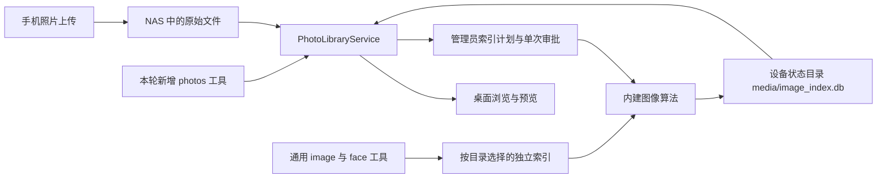

# Echo OS 源码核验与产品判断

核验日期：2026-09-05。对象是当前工作区及对应 HEAD 中的原有实现；工作区包含本任务尚未提交的修复，也有其他任务的并行存储修改。本文不把新增修复当作项目原有能力，不把静态阅读、固定向量测试和历史验收数字混为当前整机运行证据。

进一步沿默认装配、任务权威、应用包和三个照片入口的交叉核验，见 [深度架构与产品审计](PROJECT_DEEP_AUDIT_2026-09-05.md)。该报告绑定 HEAD `829fcf4`，保留当前定向回归的失败及未完成回滚工作。

## 判断与需要撤回的说法

Echo OS 已经具备内建 Agent 执行运行时、本地状态与照片索引、设备数据服务、桌面和 Linux 发行装配。称其为“面向个人设备与私有数据的 Agent OS”有源码基础。现阶段评价应围绕已有模块如何共享身份、数据和执行结果，以及各发行形态实际装配了什么。

“没有本地数据库”“没有相册”“只有一个聊天入口”都不符合原有代码。原有照片引擎有 8 张 SQLite 表、12 个已注册图片工具，原生桌面也已有照片 API 和组件。本轮新增的是人物持久命名、独立库标识和设备相册直接接线等补强。

另一个不成立的比较是“我们有 Agent，飞牛、绿联和 Omarchy 没有”。当前官方资料已经列出这些项目的 AI 或 Agent 功能。不能用过时印象构造优势，也没有依据凭代码量给四个系统打成熟度分数。

本次核查沿装配、请求、身份、工具、落盘和恢复的主链展开，并复查了异常分支；不声称已经逐行读完仓库、跑通所有模型或验证所有硬件。

## 本地数据到底在哪里

| 数据 | 原有存储与用途 | 容易混淆的边界 |
| --- | --- | --- |
| 用户记忆 | JSON/Markdown 及按租户分开的记忆文件 | 不是一张包含所有业务内容的统一 SQLite 表 |
| 对话与执行记录 | 线程 JSONL、任务状态 JSON、运行日志及 SQLite trace | 记录存在与能够安全恢复副作用是两项不同能力 |
| 工具副作用回执 | `tool_effects.sqlite3` 等执行回执与占用状态 | 用于协调、去重和处理结果未知的操作；不应无条件成为受权限约束查询的永久缓存 |
| 图片索引 | SQLite 中的向量、元数据、OCR、感知哈希、清晰度、类别原型 | 原始照片仍在文件系统；索引备份不等于原图备份 |
| 手机同步 | 自有 SQLite 中的会话、资源标识、游标和冲突信息 | 上传成功会使照片扫描缓存失效，不代表已经完成语义索引 |
| 文档/文件 Agent | 可选 `echo-storage` 服务 | 本仓有调用端，服务源码不在本仓；不能推断其内部数据库结构或完整权限实现 |

路径合同见 [paths.py](C:/飞牛os/octopus-os/runtime/platform/process/paths.py:36)，租户记忆见 [user_store.py](C:/飞牛os/octopus-os/runtime/memory/users/user_store.py:34)，照片建表见 [image_semantic_index.py](C:/飞牛os/octopus-os/runtime/memory/hemolymph/image_semantic_index.py:170)。当前运行日志默认选择及已有用户配置的保留规则见 [持久化策略](AGENT_PERSISTENCE_POLICY.md)。

原有图片表分别为 `image_clip`、`image_faces`、`image_meta`、`image_tags`、`image_ocr`、`image_hashes`、`image_quality` 和 `image_categories`。后续打磨新增 `image_people`、`image_index_settings`、`image_fingerprints` 与 `image_face_sources`；当前为 12 张表。内容指纹识别同 mtime/尺寸但内容已变化的源图，人脸来源表还区分“已完成检测但没有人脸”和“没有检测过”。本轮已加入内容与编码器身份匹配时的增量复用，原有版本没有这项优化。建表不等于每次索引都会填充全部字段；例如 OCR 有独立工具动作，桌面也尚未提供完整的人物纠错和类别管理界面。

进一步实际启动完整运行时后，确认本地事务数据远不止相册和 trace。以下 **10 个 SQLite 库也都是原有实现**，对应建库与装配源码相对当前 HEAD 无改动；在本轮隔离数据目录中实际建库。构造函数会主动创建 schema，因此文件出现证明装配发生，不证明所有业务任务已成功执行。

| 本地数据库 | 原有职责 | 需要一起理解的权限与恢复边界 |
| --- | --- | --- |
| `org.db` | 组织、部门、人类/Agent 成员、频道 ACL | 管理动作有角色检查，但登录后的全局组织目录可列出全部组织；不能等同于完整租户隔离 |
| `projectos/projectos.db` | 项目、里程碑、任务、执行认领、线程绑定与事件 | 通过 `tenant_id + owner_id` 作用域查询；恢复还需匹配线程与协作绑定 |
| `cowork/async_work.db` | 持久后台任务、线程、执行者、状态与结果 | 启动会处理滞留任务，但执行仍取决于 runner 是否启用 |
| `cowork/group_events.db`、`cowork/group_blackboard.db` | 群与线程事件、成员/模式、共享黑板、删除记录 | 与异步任务库通过 `ATTACH`、DELETE journal 和 FULL 同步协调相关删除，应作为同一恢复集合 |
| `cowork/collaboration.db` | 协作房间、项目绑定、任务与消息投影 | 房间/线程成员与租户授权；并非逐用户独立数据库 |
| `control_sessions/control_sessions.db` | 控制会话、动作、证据和事件 | 认证模式校验服务端 `creator_actor`；恢复记录不代表恢复外部设备的实时控制状态 |
| `teamroom/room_messages.db`、`teamroom/team_invitations.db` | 房间消息、重连追赶；邀请哈希、使用次数、撤销与加入申请 | 关联房间及协作库；从旧备份恢复邀请会回到当时的授权状态 |
| `workspaces.db` | 工作区挂载、所有者、租户、成员角色及挂载参数 | 原文件在挂载目标；租户与成员 ACL 都在路由检查，挂载凭据另有密钥恢复要求 |

代码依据：[组织库](C:/飞牛os/octopus-os/runtime/workspace/org_store.py:59)、[组织目录权限](C:/飞牛os/octopus-os/runtime/sensing/gateway/org_router.py:148)、[项目作用域](C:/飞牛os/octopus-os/runtime/projectos/store.py:160)、[协作装配](C:/飞牛os/octopus-os/runtime/memory/cowork/runtime.py:60)、[跨库事务](C:/飞牛os/octopus-os/runtime/memory/cowork/async_work.py:91)、[控制会话权限](C:/飞牛os/octopus-os/runtime/sensing/gateway/control_sessions_router.py:120)、[房间消息读取](C:/飞牛os/octopus-os/runtime/sensing/gateway/team_rooms_router.py:926)、[工作区权限](C:/飞牛os/octopus-os/runtime/sensing/gateway/workspace_api_router.py:163)。

原有工作区凭据存在明文降级、`ENC:` 用户值绕过加密、错密钥透传密文三个问题，均已用真实 SQLite 复现并在后续修复：敏感写入必须成功加密，在远程连接前检查；配置和 owner 成员同事务写入；解密失败不能使用缓存连接或回退本地路径，错误先经过成员权限检查。合法旧明文仍可读，没有自动迁移或换密钥，见 [加密实现](C:/飞牛os/octopus-os/runtime/workspace/crypto.py:258) 与 [安全回归](C:/飞牛os/octopus-os/tests/test_workspace_crypto_failure.py)。仍需区分密钥恢复：优先使用 `ECHO_WORKSPACE_KEY`，否则按原策略由机器标识派生；只还原数据库不保证跨机恢复凭据，见 [密钥策略](C:/飞牛os/octopus-os/runtime/workspace/crypto.py:162)。

备份也不能脱离启动形态判断：appliance 状态备份覆盖其数据根并排除 NAS 原图，脚本先停服务；镜像用户备份固定覆盖 `/home/echo` 和 `/var/lib/echo-agent`，另一份旧服务却设置 `/var/lib/echo`。因此应核对实际服务、数据根、数据库关联及密钥，而不能笼统声称所有本地库均已覆盖。依据：[状态备份](C:/飞牛os/octopus-os/appliance/state_backup.py:156)、[停服步骤](C:/飞牛os/octopus-os/deploy/appliance/backup-state.sh:144)、[镜像备份范围](C:/飞牛os/octopus-os/deploy/backup/echo-user-backup:339)、[另一服务路径](C:/飞牛os/octopus-os/deploy/echo-agent.service:47)。

## 相册链路：原来已有实现，分歧在入口与库身份

手机原图进入 `Mobile Uploads/<设备目录>/Photos/<source_path>`，上传完成后通知相册重新扫描，见 [sync.py](C:/飞牛os/octopus-os/appliance/sync.py:291)。桌面组件真实调用照片 API，服务由 [extension.py](C:/飞牛os/octopus-os/appliance/extension.py:356) 装配，数据库位置由 [service.py](C:/飞牛os/octopus-os/appliance/photos/service.py:295) 确定。

原有通用图片工具由 [builtins.py](C:/飞牛os/octopus-os/runtime/execution/suckers/builtins.py:783) 注册。它们原来使用当前目录下 `data/image_index[_目录名].db`；桌面使用设备数据目录下 `media/image_index.db`。因此原先是共享算法和 schema，默认库选择不同。不能因为两边都有 SQLite，就断言 Agent 对话一定查的是桌面那一库。

本轮通用图片工具改成规范化完整目录路径的 SHA-256 库标识，避免不同位置的同名目录相互覆盖；新增 `photos_library`、`photos_search`、`photos_status`、`photos_index_plan` 则直接绑定桌面的服务、数据库和成员策略，见 [photo_tools.py](C:/飞牛os/octopus-os/appliance/photo_tools.py)。旧索引未自动合并，外部 `echo-storage` 也未被并入这个数据库。

实际模型实现包含 FastEmbed CLIP、InsightFace 和单独使用的 RapidOCR，属于可选依赖。后续已按锁定依赖运行真实 CPU CLIP：下载模型后在阻断网络的新进程中建立三张合成图片的 512 维索引并检索；英文描述本次 3/3 排对，中文本次 1/2 排对。这只是链路与小样本证据，不能推广为中文准确率或大图库性能。Windows 本机需要测试进程加载更新的 MSVC 运行库，未修改系统或证明安装包开箱可用；真实人脸/GPU 尚未测试。完整环境、失败记录、缓存配置与限制见 [相册模型运行记录](PHOTO_MODEL_RUNTIME.md)。

规模边界必须正视：原生相册默认扫描上限为 20,000 张，单次索引默认 4,000 张；现有语义搜索从 SQLite 取出向量后，在 Python 中逐条计算相似度并排序。本轮增量构建已用真实 CPU CLIP 验证未变化三张图片零次编码、新增或替换一张只编码一次，新进程继续复用；它仍需遍历和解码入选图片，并在一个事务中提交快照。批处理、检索模型配对版本、资源预算和规模测试尚未完成，不能推算十万级图库支持。入口见 [service.py](C:/飞牛os/octopus-os/appliance/photos/service.py) 与 [索引构建](C:/飞牛os/octopus-os/runtime/memory/hemolymph/_image_index_builder.py)。

本轮还补上管理员协作取消和提交回执：提交前取消回滚保留旧索引；提交之后不能撤销为“已取消”。真实进程测试验证，索引与回执同事务提交后，即使后台任务 JSON 尚未更新，重启也能依据相同库、任务、计划及人脸选项恢复结果。提交前中断仍明确失败，不声称逐图片续算；详见 [打磨与验证记录](AGENT_OS_POLISH_STATUS.md)。

## 为什么不能只查“工具已注册”

一次设备相册请求至少跨越：浏览器凭证 → Agent 的可信 Session → 工具发现及执行器 → 设备相册服务 → 成员目录可见范围 → 索引与原图 → 执行结果。重新查询、后台执行和任务恢复也必须维持这些约束。

原有运行时并非只有工具列表，其具体执行链如下：

| 环节 | 已核验的实际实现 |
| --- | --- |
| 启动 | [cli_serve.py](C:/飞牛os/octopus-os/runtime/cli_serve.py:661) 创建内核；[builder.py](C:/飞牛os/octopus-os/runtime/platform/config/builder.py:103) 装配注册器、信任策略、执行器、图运行时与 planner |
| 请求身份 | [WebSocket 入口](C:/飞牛os/octopus-os/runtime/sensing/gateway/_realtime_gateway_session.py:92) 验证凭证，并以服务端 actor/tenant/owner 覆盖客户端身份字段 |
| Session 与执行 | [ReAct producer](C:/飞牛os/octopus-os/runtime/sensing/gateway/_realtime_react_stream_drive.py:533) 绑定 Session 和 journal 上下文；[dispatch](C:/飞牛os/octopus-os/runtime/core/cerebrum/_react_execution_dispatch.py:391) 调用真实 ToolExecutor |
| 审批与副作用 | [executor.py](C:/飞牛os/octopus-os/runtime/execution/tool_engine/executor.py:435) 进行治理/能力/审批检查，执行后先提交回执再写 Step；[effect_receipts.py](C:/飞牛os/octopus-os/runtime/execution/tool_engine/effect_receipts.py:299) 对已进入但无完成结果的副作用保留不确定状态 |
| 持久化 | [AppState](C:/飞牛os/octopus-os/runtime/platform/ui/state.py:76) 使用任务 JSON，另有线程 JSONL 和 trace/effects SQLite。某个 journal 选择内存不等于全部 Agent 状态都只存在内存 |
| 恢复 | [checkpointing](C:/飞牛os/octopus-os/runtime/core/cerebrum/react_checkpointing.py:37) 默认每 10 次迭代保存检查点；[resume](C:/飞牛os/octopus-os/runtime/core/cerebrum/react_resume.py:135) 依赖 journal/trace 重建执行，Redis 镜像有显式配置条件 |

因此，“继续一个任务”同时涉及执行状态、工具回执、当前权限和外部实际状态。本轮私有相册授权不会写入检查点；旧 Session 或检查点本身不能成为新凭证。任务投影应继续读取运行时权威，而不是另建一套会自行声称执行完成的 OS 任务数据库。

本轮沿这条链发现并处理的具体问题包括：

- 同一个工具函数在直接调用时检查权限，不代表执行器从历史回执重放输出时也会检查。已实际复现 ReAct 在撤权后返回旧相册统计；本轮修复覆盖 ReAct 回执与 Codex 动态工具重复 callId 两个入口，相同任务/步骤回归见打磨记录。
- 查询开始时身份有效，不代表模型返回时仍有效；账户撤权、过期和权限变化需要在结果发布前复核。
- 原有 WebSocket 凭证还支持 `bearer.b64`，设备会话撤销必须与运行时使用同样的严格解析。
- 先取全库 top-k，再过滤成员权限，会让其他成员的照片占满候选位，导致自己可见的照片漏搜。候选范围应在排序前限定。
- 仅用最终字符串路径验证图片，不能覆盖读取期间的目录替换；Windows 也需要原生文件句柄验证，不能把 POSIX 安全标志替换成零。

设备共享策略原有默认缓存为 2 秒，当前工作区已将默认设为零并明确禁用缓存；若显式启用正 TTL，仍有其配置时效边界。不能将上述改进描述为“全仓所有文件工具都已统一 NAS ACL”，也不承诺撤权会抹去用户此前已取得的历史内容。

## 发行形态决定真实系统权限

| 形态 | 实际装配与权限 | 可以据此判断什么 |
| --- | --- | --- |
| 源码开发 | 回环后端、Vite 和开发配置 | 适合联调；不等于生产身份和整机交付已经验证 |
| 默认 Docker appliance | 完整 appliance 扩展；主进程降权，挂载状态和 NAS 数据；受限 sidecar 管理应用 | 可以操作被挂载的数据和允许的应用；本机命令看到的是容器环境，不能直接当作宿主存储控制 |
| netinst/provision | root 身份运行完整 appliance 扩展 | 可以接触宿主受支持存储控制，因此需要按写能力逐项验收 |
| mkosi/raw | echo 用户运行 native 扩展；原生系统能力另经 Electron IPC | 不能把容器版或 root 服务的 NAS API 当成该形态的默认能力 |
| 独立 Electron 安装包 | 独立用户目录、打包 Agent 与本地 launcher | 默认没有自动注入完整 appliance 扩展，也不能视为 NAS 发行配置 |

具体装配见 [Docker 卷与权限](C:/飞牛os/octopus-os/deploy/appliance/docker-compose.yml:180)、[容器降权入口](C:/飞牛os/octopus-os/appliance/entrypoint.py:131)、[root 整机服务](C:/飞牛os/octopus-os/deploy/provision/base/echo-appliance.service:10)、[native 服务](C:/飞牛os/octopus-os/deploy/agent/echo-agent.service:10) 与 [Electron launcher](C:/飞牛os/octopus-os/frontend/electron/backend-runtime.cjs:620)。原生桌面已有 Wi-Fi、蓝牙、音量、亮度、电源和更新控制，见 [system-controls.cjs](C:/飞牛os/octopus-os/frontend/electron/system-controls.cjs:14)；不能把 native 扩展较窄误解为没有系统功能。

当前原生存储代码已调用 Linux、SMART、mdraid、ZFS 和配额工具，保留 `OmvDataAccessPolicy` 等兼容名字不等于仍依赖 OMV 服务。已有共享、账户、SMB/NFS、根目录 ACL 和部分配额的受控写面；复杂磁盘生命周期仍需依据实际 provider 和候选制品验证，不能从 UI 卡片推断能力已经开放。

本轮复现并修复了原生健康探测把空数据当成功的问题：命令缺失、超时、权限拒绝和解析失败保留独立证据；部分观测保留已取得容量，缺测显示 unknown/degraded，真实 SMART/ZFS/阵列故障继续报警。交叉复查还覆盖未挂载 ZFS 成员、池状态变化和挂载选项读取失败；前端不再把这些状态渲染成绿色。只读命令已移入线程池，避免阻塞 Agent 请求，见 [探测证据](C:/飞牛os/octopus-os/appliance/native_storage_probe.py)、[聚合实现](C:/飞牛os/octopus-os/appliance/native_storage.py) 与 [路由](C:/飞牛os/octopus-os/appliance/native_storage_routes.py:44)。这些是本轮补强，不能倒算为原有能力。挂载选项未知时的写入前置检查另由并行任务处理，本报告不据读取修复声称所有写入门已经修复。

安装、升级、回滚、恢复实验台和验收脚本已经存在，应当基于它们继续推进。脚本存在、测试通过、VM 启动和物理盘故障恢复属于不同证据；[NAS 交付状态](NAS_DELIVERY_STATUS.md) 中的旧 OMV/sibling UI 描述及历史数字也不能直接晋升为当前架构的运行结论。

mkosi 路线已有签名验证、目标盘校验、A/B root、UKI、dm-verity、LUKS2 数据分区，以及更新时最后写 UKI 和启动计数。具体实现见 [安装器](C:/飞牛os/octopus-os/deploy/installer/echo-os-installer:178)、[更新器](C:/飞牛os/octopus-os/deploy/update/echo-os-update:265) 与 [Recovery](C:/飞牛os/octopus-os/deploy/recovery/echo-recovery:45)。netinst 是另一安装路线，不能直接继承上述 A/B 结论。本次找到已有 netinst VM 与 Android 模拟器验收记录，但未核实与当前 SHA 绑定的新候选完整通过这些门禁。

## 文档与恢复链路：有模块之后，还要核对结果

通用 Agent 工作台原本已有工作区选择、计划与批准、任务跳转、产物和差异入口。
本轮没有另建任务中心或调度数据库，而是沿文件操作与结果回读发现以下问题：

| 实际复现 | 本轮修复及仍需区分的边界 |
| --- | --- |
| 直接读取私有子目录被拒绝，但复制可读父目录后私有文件也被带出；移动/回收父目录会影响不可写子目录 | 递归操作检查全部嵌套权限；实际目标目录拼接和恢复冲突改名后再次授权。没有据此宣称已解决外部进程替换宿主路径的所有竞争 |
| 原件链接被当作上传附件路径，缺失时按 basename 返回同名旧附件；Windows 原件 URL 还可能拼接错误 | 新增受线程/租户/工作区权限约束的 `/api/fs/content`；上传读取使用精确路径；前端重新打开原件重新读取，等待和失败时不展示旧缓存 |
| 100/500、250/500 个步骤都显示 100% | 原始计数先算比例，只对结果限幅；非有限值、布尔值和无效计数不伪装成完成 |
| 默认零秒权限缓存在同一时钟 tick 仍命中旧授权；Windows 创建上传会话在目录 fsync 处报错 | 禁用缓存时每次重建权限；上传元数据使用相应平台的替换边界。真实 Windows 服务重启续传通过，不当作断电持久性证明 |
| NAS 恢复目录仅核对数量和字节数；切换后仓库检查失败会留下已经恢复的数据，却只能报告普通失败 | 仓库检查移到切换前；恢复前 staging 与恢复后 live 树按内容、路径、类型及链接目标比较 SHA256；持久回执允许重试只核验现有文件 |

依据：[递归权限回归](C:/飞牛os/octopus-os/tests/appliance/test_file_recursive_authorization.py)、
[原件回读](C:/飞牛os/octopus-os/runtime/sensing/gateway/_fs_router_content.py)、
[任务进度](C:/飞牛os/octopus-os/appliance/task_projection.py)、
[NAS 恢复](C:/飞牛os/octopus-os/deploy/appliance/nas_data_backup.py)。这些是本轮改进，不能算作原有版本的完成度。

原件接口目前最多读取 128 MiB，支持单区间 Range；远程挂载仍按原有全文件读取合同，
不是大文件流式服务。共享部署下，NAS 路径不因出现在 Agent 文本中就自动获得线程
工作区权限。恢复的 `contentVerified` 表示 live 与切换前 staging 一致，不是另从
仓库建立的独立文件清单验证；恢复传输中途失败仍需重新传输。

启动验证还确认：`appliance.entrypoint.prepare_runtime_config` 把持久设备凭据写入
Agent 的 `local_auth` 配置，这是正式入口统一认证的实际接线。仅挂载设备扩展并设置
管理员环境变量的回环开发启动，不能据其设备 API 返回 401 就断言全部 Agent API
已开启认证。本轮使用真实配置生成器和完整 CLI 两次隔离启动，核对原件字节、
图片 Range、同名附件区分、NAS 移动/冲突/回收恢复与重启续传，见
[CLI 结果](C:/飞牛os/octopus-os/tmp/document-readback-cli-7ozagrmw/result.json)。这仍是
脚本驱动的合成文件流程，没有证明自然语言计划、执行与撤销的完整场景。

## 与飞牛、绿联、Omarchy 应怎样比较

以下是官方文档中能够确认的功能范围，不是本次上机测评，也不作稳定性和吞吐排名。

| 对象 | 当前可确认的重点 | Echo 应对照的实际问题 |
| --- | --- | --- |
| 飞牛 fnOS | 官方已有本地 AI 相册，包含人物管理、描述搜图、分类及视频识别 | 相册的模型安装、增量入库、人物纠错、移动端与大库使用链路，不能只对比是否有 CLIP |
| 绿联 UGOS Pro | 已有模型管理、共享预处理数据和工具授权；iDX 的 Uliya 可执行智能指令 | 多个应用能否共享受授权的数据和模型，以及执行结果是否可检查 |
| Omarchy | Arch/Hyprland 桌面发行，已整合 Agent 启动、选择、使用量界面与崩溃诊断 | 桌面交互、系统维护和 Agent 对日常设备任务的实际帮助 |

依据分别为 [飞牛 AI 相册说明](https://help.fnnas.com/articles/v1/photo/photo-ai)、[UGOS Pro 模型管理](https://www.ugnas.com/play-detail/id-139.html)、[Uliya 使用指南](https://www.ugnas.com/play-detail/id-138.html)、[Omarchy 手册](https://omarchy.org/manual/) 与 [Omarchy AI 集成](https://omarchy.org/manual/ai/)。绿联上述文档适用 1.18.1.0098 及以后，Uliya 及部分功能限制于 iDX；不能推广到所有绿联设备。

Echo 的差异化方向应是：把个人数据、跨应用任务、权限、执行回执与恢复做成同一套可验证工作流。源码中的运行时和设备适配层为此提供了基础；是否已经优于竞品，仍需同场景实测。照片、人脸和本地模型本身已不足以证明领先。

若“算力 Agent OS”指统一管理跨节点 GPU 资源，目前证据还不支持这种交付定位。本机线程调度、模型适配探测、设备能力选择和预留 K8s 执行 API，都不能替代已装配的多节点资源发现、配额、分配、故障迁移和实际 GPU 作业证据。

例如 [TentaclePool](C:/飞牛os/octopus-os/runtime/tentacle/pool.py:137) 做设备能力选择，[hwfit.py](C:/飞牛os/octopus-os/runtime/sensing/model_router/hwfit.py:1) 做本机模型适配；[K8sBackend](C:/飞牛os/octopus-os/runtime/sensing/server/k8s.py:211) 有 Pod 执行实现，但 [server 包说明](C:/飞牛os/octopus-os/runtime/sensing/server/__init__.py:1) 明确其尚未自动接线。Redis 副作用协调也不是 GPU 调度。

## 由源码问题推导的优化顺序

| 顺序 | 具体工作 | 验收标准 |
| --- | --- | --- |
| P0 数据正确性与权限 | 完成本轮索引事务、目录库身份、真实执行器授权、候选过滤和状态真实性修复 | 同名目录不混库；失败重建保留旧索引；同一调用重试按当前权限查询；探测失败不显示健康 |
| P1 固定支持的装配合同 | 为开发、Docker、root 整机、native/Electron 明确 provider、权限和状态目录 | 从实际运行配置生成可用能力；每个支持形态都能启动、认证、执行和恢复；缺服务给出原因 |
| P1 统一数据身份 | 定义 library ID、根目录、owner/ACL、索引版本和来源关系，让 UI 与工具消费同一服务 | 同一用户两入口结果一致；移库、改权限、换盘后不串库；不强行合并所有职责不同的 SQLite |
| P2 补完整个人数据任务 | 先走通找照片、文档整理、备份恢复三条现有场景 | 用户请求→计划→必要审批→执行→结果回读；中断、冲突、撤权和部分失败都有明确状态 |
| P2 模型与图库交付 | 模型安装/缓存/离线、增量更新、资源预算、人物管理、分规模基线 | 分别记录冷启动、热查询、更新成本、召回和成员隔离；达到实测容量后再声明支持规模 |
| P3 正式整机验证 | 沿已有 G1–G6 与候选制品进行安装、升级、回滚、断电和存储故障验收 | 保留 revision、制品哈希、环境与原始日志；真实数据恢复结果可比对 |

这套顺序保留项目原有的大目标，把近期工作锚定在可复现的问题和真实用户任务。无需再凭印象新增另一套相册、数据库或调度器。

## 本机证据的限度

本轮 Windows 定向回归覆盖真实临时 SQLite、真实 JWT/HTTP/WebSocket、文件与子进程以及前端请求竞争；模型行为使用固定向量。后续已补 Windows 原生状态锁和私有 ACL，并用静态 planner、隔离 NAS 与状态目录实际启动完整 CLI 两次：登录、照片原图、四个设备相册工具目录和重启认证通过。当前结果与命令见 [打磨记录](AGENT_OS_POLISH_STATUS.md)。此证据没有覆盖真实模型推理、Linux 存储写入或整机交付。

早期启动暴露的三个设计插件 manifest 声明/注册不一致已修复，当前真实 CLI 均能加载；剪辑插件缺 `av` 时保留项目与图片功能，视频动作明确 503。随后安装锁定 PyAV 18.1.0，在合成媒体上实跑 H.264 导出/解码、AAC 双音轨混流及生成视频再快照，见 [媒体证据](C:/飞牛os/octopus-os/tmp/clip-studio-media-smoke-goa8kt3t/result.json)。这些证据不包括外部 ComfyUI 服务、GPU 工作流或生产编解码矩阵。Windows 软沙箱限制仍存在。

没有在本轮证明：代表性视觉模型精度、默认配置自然语言完整任务、全仓测试全绿、Linux 新候选构建、真实 Docker 应用生命周期、物理机阵列故障、长期运行或已执行的用户数据备份。它们继续保留在交付目标中。
