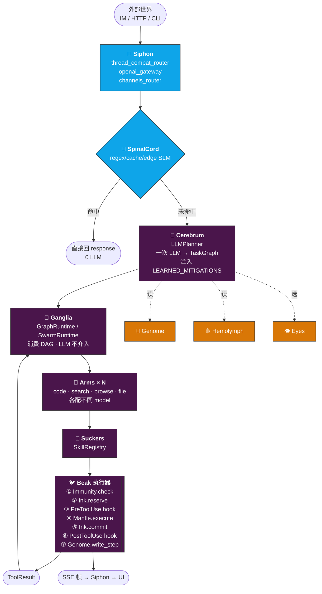
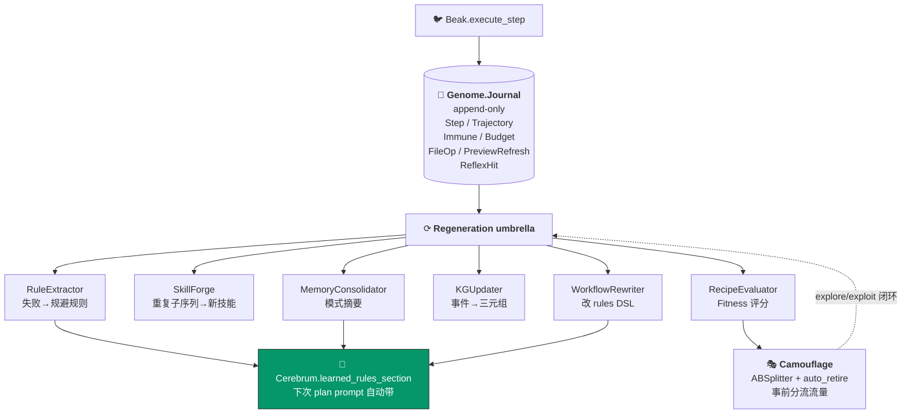
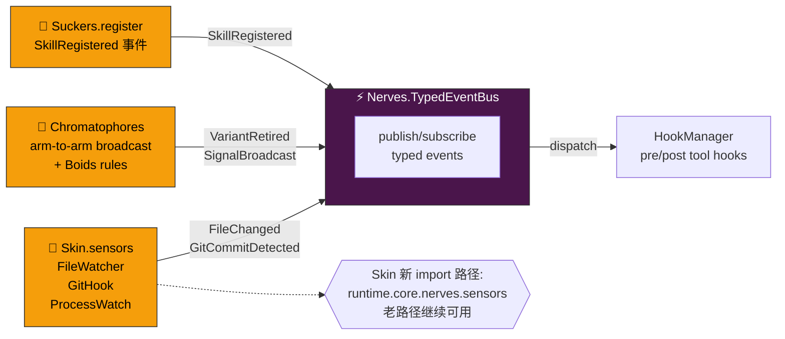
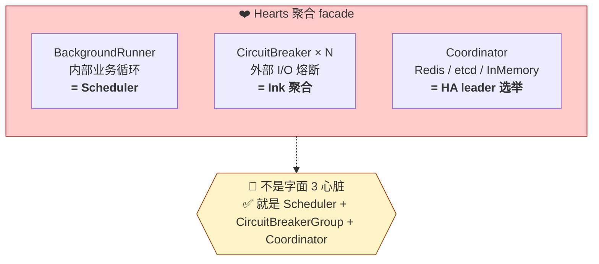
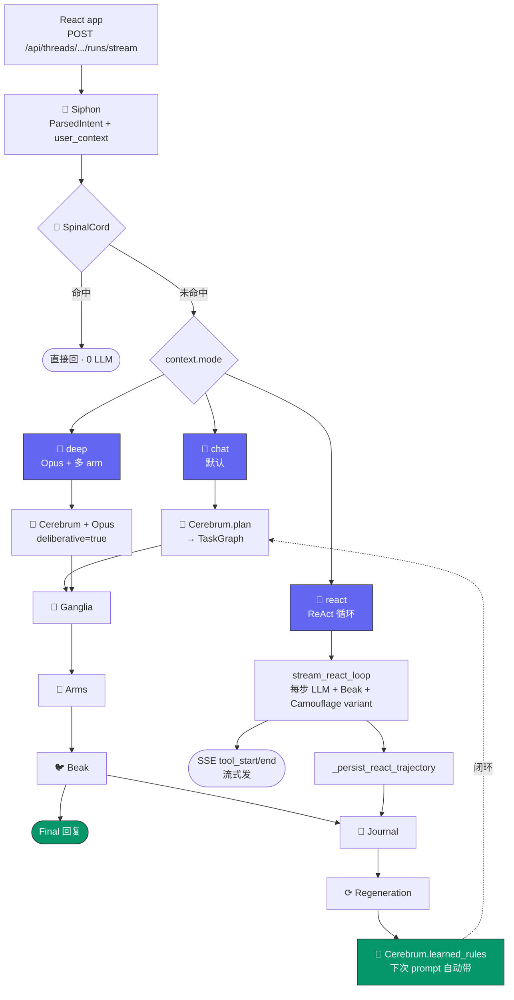
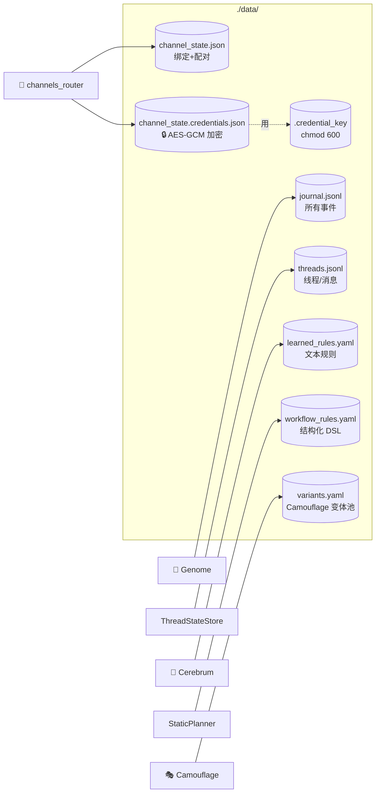

# Echo 架构图（Mermaid 版）

`high-res-map.md` 的 ASCII 图对应的 Mermaid 版。GitHub / GitLab / 大多数 Markdown 渲染器原生支持，能直接渲染成可交互的 SVG。

终端阅读者用 [ASCII 版](./high-res-map.md)；浏览器阅读者读这份。

---

## 图 1 · 一次请求的完整旅程



---

## 图 2 · 治理侧事件流（自进化闭环）



---

## 图 3 · 内部事件总线



---

## 图 4 · Hearts 去诗化真相



---

## 图 5 · 前端入口到后端全链路



---

## 图 6 · 数据持久化矩阵（补充）



---

## 如何用这份文件

**浏览器**：GitHub / GitLab / Obsidian / VSCode Preview 都会自动渲染 `mermaid` 代码块为 SVG。
点击某个节点未来可加跳转（Mermaid 支持 `click` 指令，若想加点击跳源码行号）。

**PPT / 演示**：导出每个 Mermaid 为 PNG 再贴；或用 `mermaid-cli` 批量：
```bash
mmdc -i high-res-map.mermaid.md -o diagrams/ --outputFormat svg
```

**迭代**：想加新器官或改连线？**只改这份文件**，ASCII 版（`high-res-map.md`）作为降级不必每次同步；用户用哪份就用哪份。

---

## 对齐说明

本文件的 6 张图 **严格对齐** [`high-res-map.md`](./high-res-map.md) 的 ASCII 版（标题、节点、连线一致）；额外新增第 6 张数据持久化矩阵（ASCII 版是纯表格，Mermaid 版画成图更直观）。

若发现两版不一致 → 以 ASCII 版为准（是主 source），修 Mermaid 版来追齐。
