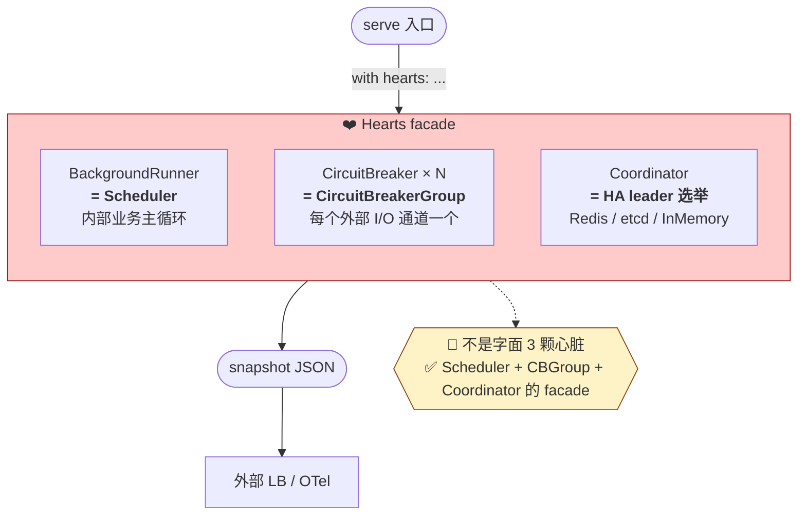

# ❤️❤️❤️ Hearts · 三颗心脏（双循环隔离）

**生物原型**：章鱼有 3 颗心脏，做**两种完全不同的循环**：
- **体循环**（Systemic）：1 颗系统心，把含氧血推向全身 —— **内部运作**
- **鳃循环**（Branchial）：2 颗鳃心，推血过鳃做气体交换 —— **与外界交互**
- **两套循环物理隔离** —— 鳃部异常时体循环不会立即崩溃

## 核心架构原则：双循环隔离

> **外部 I/O 和内部业务必须走两套独立的"心跳"。**
> 一个 API 挂了不该拖死整个 agent 循环。

这是经典的 **Bulkhead Isolation**（舱壁隔离）模式，章鱼生理学直接给了它天然对应。

## 新分工

| 心脏 | 对应生物 | 驱动的事 | 失效影响 |
|---|---|---|---|
| **Systemic Heart** ×1 | 体循环 | **内部业务主循环**：Cerebrum tick、会话状态、任务编排 | 业务停摆 |
| **Branchial Heart A** ×1 | 左鳃心 | **外部 I/O 循环 A**：LLM Provider 调用、MCP 远程调用 | 外部调用受阻，业务降级 |
| **Branchial Heart B** ×1 | 右鳃心 | **外部 I/O 循环 B**：第三方 API、webhook、集成协议 | 同上 |

## 为什么这样分 —— 三个真实好处

### 1. 离线降级
外部 API 全挂时，**Systemic Heart 仍跳动**，系统仍能：
- 读本地缓存回复（与 Spinal Cord 配合）
- 把任务入队等外部恢复
- 维持用户会话不断线

### 2. 阻塞隔离
LLM provider 300ms 抖动不会把**主循环阻塞**。外部调用全部异步发到 Branchial 通道。

### 3. 独立背压
I/O 压力大时只降鳃心频率，不影响业务节律；反之亦然。

## 接口
```python
class Hearts:
    systemic: SystemicHeart      # 内部业务节拍
    branchial_a: BranchialHeart  # 外部 I/O 通道 A
    branchial_b: BranchialHeart  # 外部 I/O 通道 B

    def beat(self): ...          # 各自独立 tick
    def dispatch_io(self, call) -> Future:
        # 路由到 A 或 B（负载均衡 / API 类型分区）
```

## 心跳节律（各自独立可调）

| 心脏 | 正常 | 预算紧张 | 外部降级 |
|---|---|---|---|
| Systemic | 500ms | 2s | 不变（本地业务继续）|
| Branchial A/B | 200ms | 1s | 大幅降频 / 暂停 |

## 与 HA 的关系
HA 不是 Hearts 的首要职责（交给 `hearts.count` 多实例 + Raft quorum 做）。
Hearts 的**首要职责**是**功能隔离**，HA 是派生能力。

## 进化关联
- **⑥ 成本治理**：Branchial 独立节律是外部 API 成本节流的主闸
- **⑤ 分布式执行**：两套循环让 edge/cloud 协同更自然（内部可纯本地，外部走云）

## 一句话原则
> 双循环是生物界几亿年的答案：**把"与外界交互"和"维持自己活着"分开**。
> 用在 Agent OS 就是 —— **别让一次 API 超时把你整个 agent 冻住**。

---

## Implementation Map · 当前代码里怎么落地

**bulkhead 不是一个 `Hearts` 类 —— 是分布在 5 个组件里的组合拳。**
未来如果真要集中成 `runtime/hearts/`，也是一个聚合 facade，不是重新发明。

| 设计层面 | 现有实现 |
|---|---|
| **主业务循环**（Systemic）· 常驻 daemon 线程跑定时任务 | `runtime/scheduler/` · `BackgroundRunner` |
| **外部 I/O 节拍**（Branchial）· LLM/MCP 调用保护 | `runtime/ink/breaker_router.py` · `BreakerModelRouter` + `CircuitBreaker` |
| **外部 I/O 异步隔离** · subprocess 阻塞不回传主线程 | `runtime/mcp_client/persistent_client.py` · 后台 asyncio loop + `run_coroutine_threadsafe` |
| **执行层并发隔离**（腕间） | `runtime/swarm/runtime.py` · ThreadPoolExecutor |
| **进程级隔离**（不可信 skill） | `runtime/mantle/subprocess_mantle.py` |
| **长跑进程入口** · 把上面全部组装 | `echo-agent serve --config X.yaml --port 8000` |

### `serve` 子命令 · Systemic 的真实入口

```bash
echo-agent serve \
    --config config.yaml \
    --port 8000 \
    --learn-interval 3600     # 每小时反思一次（可选）
```

行为：
1. `BackgroundRunner.start()` · 后台 daemon 线程
2. 把 `config.intel_sources` 的每一项按 `frequency_seconds` 挂成 periodic 任务
3. 可选：按 `--learn-interval` 定时跑 `learn_from_journal` / `learn_memories_from_journal`
4. 启动 FastAPI UI（与 scheduler 共享同一 journal + registry）
5. Ctrl-C / SIGTERM → 优雅 stop scheduler + uvicorn + 打印任务统计

### 为什么不叫 Hearts

- `BackgroundRunner` 单线程足够 —— "三颗心"的 2 鳃心分池在当前用例下就是一个 ThreadPoolExecutor 换皮
- 真需要按 I/O 类型分池（LLM 热路径 vs webhook 事件流），给 `BackgroundRunner` 加 `ThreadPoolExecutor(pool=...)` 参数即可，不必重起一个 `hearts/` 目录

## 现状：聚合 facade 已落地（`runtime/hearts/`）

~100 行的聚合 facade · 不重新发明任何东西：

```python
from runtime.core.hearts import Hearts
from runtime.adapters.scheduler import BackgroundRunner
from runtime.safety.budget_breaker import CircuitBreaker

hearts = Hearts(
    systemic=BackgroundRunner(),
    branchial={
        "llm": CircuitBreaker(...),
        "mcp": CircuitBreaker(...),
    },
)

with hearts:
    breaker = hearts.dispatch_io("llm")   # 拿通道 breaker 包 I/O
    breaker.check()
    ...
    if not hearts.healthy():              # 统一健康探针
        ...
    snap = hearts.snapshot()              # JSON 可序列化 · 喂 UI / OTel
```

**存在价值**：
1. `serve` 入口一行 lifecycle（`with hearts:`）· 不用手攒各组件 start/stop
2. UI / OTel 单点 `hearts.snapshot()` 拿全链路健康
3. bulkhead 双循环原则在代码层可 `from runtime.core.hearts import Hearts` 发现

**不做什么**：
- 不重新包 scheduler / breaker · 纯组合
- 不搞独立心跳线程 · systemic 心跳=scheduler 主循环 · branchial 是惰性状态机
- 不做多节律 / pool 分池 / HA —— 真遇到再扩

## 结构图(去诗化版)


