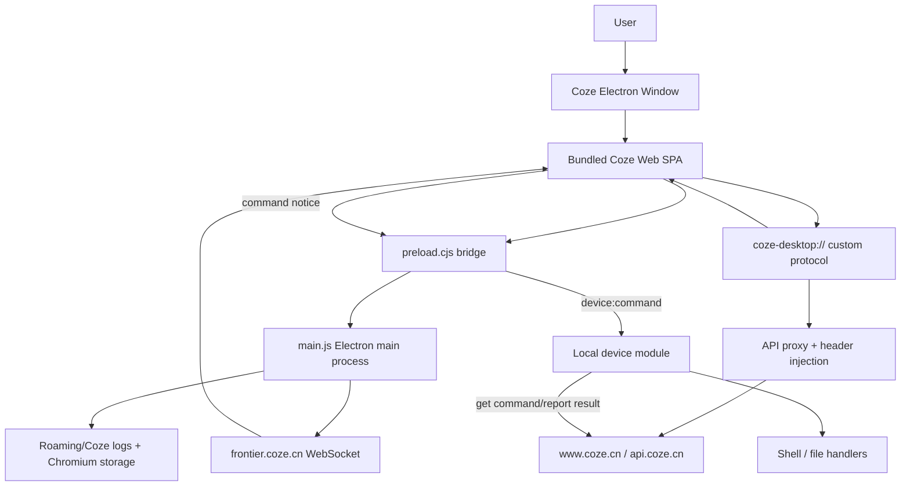
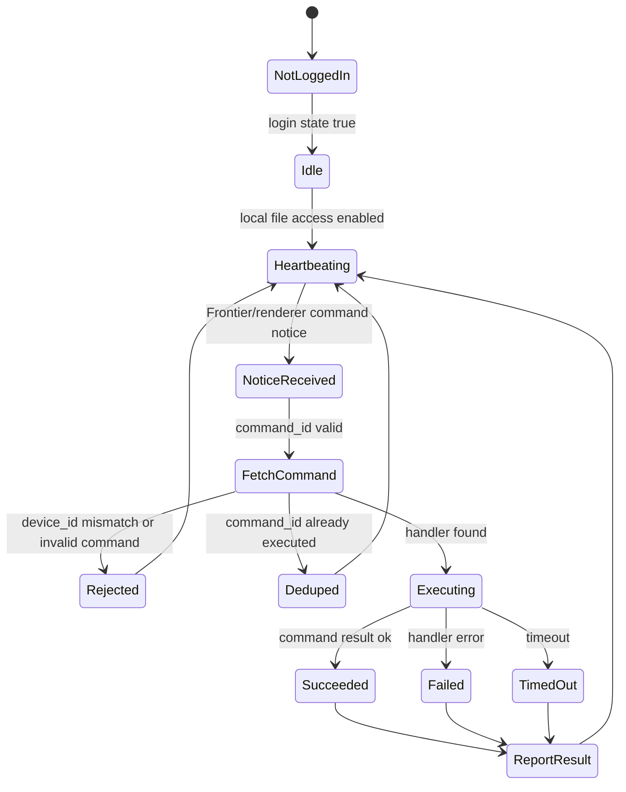

# Coze Desktop Reverse Report

Date: 2026-06-05
Target: `D:\Users\12035\AppData\Local\Programs\Coze`
Scope: authorized local static/runtime/product reverse analysis. This report deliberately avoids account bypass, credential extraction, token/cookie reuse, license bypass, or cracking.

## Executive Summary

Coze Desktop is not just a browser wrapper. It is an Electron/Aha Electron desktop shell that loads a bundled Coze Web SPA through a custom protocol, then uses the main process as a trusted bridge for auth-context injection, CORS/header rewriting, device heartbeat, local file/command execution, and desktop-agent control.

The product pattern worth learning is:

1. Put the Web product in a controlled desktop origin.
2. Keep the native bridge narrow and explicit.
3. Register the device with heartbeat.
4. Let cloud sessions send command notices.
5. Fetch full command content only after device/user context checks.
6. Execute locally with reporting and artifact upload.
7. Render the experience as a friendly agent/session timeline, not as raw developer logs.

For Echo, the closest next step is not "copy Coze", but build a safer "Local Device Hub": device identity, permissions, heartbeat, command inbox, preview-confirm-execute actions, and a novice-friendly execution timeline.

## Evidence Inventory

Confirmed local artifacts:

- Install root: `D:\Users\12035\AppData\Local\Programs\Coze`
- Main executable: `Coze.exe`
- Electron package: `resources\app.asar`
- Extracted analysis copy: `tmp/coze-asar-full`
- Main entry: `tmp/coze-asar-full/package.json` -> `main/bootstrap.js`
- Main process bundle: `tmp/coze-asar-full/main/main.js`
- Preload bridge: `tmp/coze-asar-full/main/preload.cjs`
- Renderer entry: `tmp/coze-asar-full/renderer/index.html`
- Runtime user data: `C:\Users\12035\AppData\Roaming\Coze`
- Updater cache: `C:\Users\12035\AppData\Local\coze-updater`

Package facts:

- Product name: Coze
- Version: 1.1.0
- Package: `cn.coze.desktop`
- Main: `main/bootstrap.js`
- Dependencies: `electron-updater`, `koffi`
- Runtime: Electron 39.2.7, Chrome 142, Node 22
- Region/channel: CN / stable

Observed runtime shape:

- Main process plus Chromium child processes: renderer, GPU, network service, monitor, audio, video capture, crashpad.
- Current window title observed from process list: `扣子 - 技能商店`.
- Established TCP connections were to local proxy `127.0.0.1:1081`, so domain-level runtime evidence came from logs and static bundle.

## 1. Security Audit

### 1.1 Window And Renderer Boundary

The main window is created with a conservative Electron posture:

- `contextIsolation: true`
- `nodeIntegration: false`
- `sandbox: true`
- `webSecurity: true`
- `allowRunningInsecureContent: false`
- External navigation is intercepted and opened in the system browser.

IPC is guarded by a trusted-sender check. The main process checks that IPC comes from the main window top-level frame and from a trusted renderer URL. This is important because the preload bridge exposes local-device capabilities.

Risk level: medium.

Reason: the posture is good, but any future iframe/top-level origin bug around trusted URL detection could become high impact because the bridge can reach local file and command handlers.

Echo implication:

- Keep our page-agent and Electron bridge split by trust zone.
- Every bridge call that can affect local state should include sender validation, route/origin validation, and a user-visible reason.

### 1.2 Custom Protocol

Coze registers a custom protocol:

```text
coze-desktop://-/
```

The protocol serves files from the bundled renderer directory and falls back to `index.html` for SPA routes. Path resolution normalizes and checks that the target is still under the renderer root, reducing path traversal risk.

It also proxies renderer-relative API requests:

```text
/api/*
/v1/*
/passport/*
```

to:

```text
https://www.coze.cn
```

Risk level: medium.

Reason: the protocol handler is a central trust boundary. File path normalization looks deliberate, but API proxy behavior makes the desktop shell part of the auth and CORS model.

Echo implication:

- If we add a packaged desktop protocol, it should keep static serving, API proxying, and local command bridge as separate modules with separate logs and tests.

### 1.3 Header/Auth Context Injection

The main process rewrites request headers for Coze domains:

- Origin and Referer set to Coze web origin.
- Coze cookies are attached to API/passport calls.
- CSRF header is derived from passport CSRF cookies when needed.
- `x-coze-account` is injected from desktop login state.
- Desktop headers include `x-space-client`, desktop version, and desktop device identity.

Risk level: high if mis-scoped, otherwise expected for a desktop shell.

Reason: this bridge has the authority to turn a local renderer API request into an authenticated Coze web request. Any renderer XSS or IPC trust bug could amplify into account-scoped API access. I did not extract or print any cookie/token values.

Echo implication:

- Do not make auth-context injection a generic helper.
- Keep auth proxying domain-scoped and method-scoped.
- Make security logs redacted by default.

### 1.4 Device Command Channel

Coze has a local device command channel built around these APIs:

```text
POST /api/coze_claw/desktop/heartbeat
GET  /api/coze_claw/desktop/get_command
POST /api/coze_claw/desktop/report_command_result
```

Command notice flow:

1. Renderer receives or forwards a command notice.
2. Main process validates IPC sender.
3. Main process fetches full command by `command_id`.
4. Device ID is checked against local device ID.
5. Duplicate `command_id` is ignored.
6. Command handler runs with timeout.
7. Result is reported back.

Supported desktop command types observed:

- Bash
- ReadFile
- WriteFile
- EditFile
- UploadFile

Risk level: high.

Reason: this is the remote-to-local control plane. It is product-critical, but it deserves a dedicated threat model: replay, confused deputy, path scope, command injection, stale device assignment, and auditability.

Echo implication:

- Our current preview-confirm-execute pattern in `/api/computer` is safer for high-risk UI actions.
- For remote/local command inbox, every command should carry a human-readable intent, requested scope, expiration, and visible approval status.

### 1.5 Local File And Command Boundaries

Coze uses different boundaries for Bash and file operations.

Bash path model:

- Default workspace is under the user home `Coze` directory.
- Shell cwd is constrained to allowed paths unless the call opts into full access.
- Shell execution uses sandbox policy and timeout.

File operation model:

- ReadFile/WriteFile/EditFile/UploadFile resolve file path relative to cwd/default workspace.
- Code comments explicitly say file commands do not reuse the product-level Bash allowed-path policy.
- File commands rely on OS permission and macOS TCC preflight where applicable.
- File size limit is 200 MB.

Special connect-agent model:

- Renderer calls `device:connect-agent`.
- Main process allows only:
  - `npx -y coze-bridge@latest ...`
  - `npx -y @coze/bridge@latest ...`
- Execution uses `fullAccess: true`.

Risk level: high.

Reason: file commands and connect-agent are high impact. Coze has validation and some whitelist controls, but the model still centers on cloud-controlled commands reaching a local desktop runtime.

Echo implication:

- Prefer capability-scoped grants over path strings.
- File read/write/upload should share one explicit permission model.
- Full-access bridge install/connect should be a separate user-confirmed ceremony, not a normal tool call.

### 1.6 Updater, Telemetry, And Logs

Updater config points to a generic provider URL under ByteDance cloud object storage.

Telemetry/logging domains observed:

- `pc-mon.zijieapi.com`
- `moment.bytedance.com`
- `log.snssdk.com`
- browser/slardar monitor endpoints

Risk level: medium.

Reason: normal for commercial desktop apps, but from a privacy/compliance perspective these should be listed in a data-flow inventory.

Echo implication:

- For our app, surface telemetry/offline mode clearly.
- Logs should avoid device IDs, command payloads, file content, and secrets unless debug mode is explicitly enabled.

## 2. Product Architecture Reverse

### 2.1 High-Level Architecture



### 2.2 Domain Model

Core domains inferred from static API surface:

- Marketplace: skill/bot/template discovery and installation.
- Space/project: workspace, project, repo, deployment, project members.
- Conversation/session: chat, message list, session background/main state.
- Agent/Claw: desktop agent identity, pairing, status, local resources.
- Desktop/device: heartbeat, command fetching, command reporting, local file access.
- File: tree/list/read/write/update/upload/version/archive/download.
- Browser/computer/mobile use: operate, screenshot, task list, subscribe.
- Resource: model config, model list, storage usage, export, generated docs/PPT.
- Channel: Feishu/WeChat binding and callbacks.
- Memory/dataset/workflow/plugin: expected Coze agent-building primitives.

### 2.3 API Surface Snapshot

Static scan found around 1,877 API paths in the bundled code. The largest categories were:

- `api/marketplace`
- `api/coze_space`
- `api/playground_api`
- `api/permission_api`
- `api/intelligence_api`
- `api/coding`
- `api/conversation`
- `api/memory`
- `api/workflow`
- `api/plugin`
- `api/coze_claw/*`

Important Coze Claw paths:

- `/api/coze_claw/desktop/heartbeat`
- `/api/coze_claw/desktop/get_command`
- `/api/coze_claw/desktop/report_command_result`
- `/api/coze_claw/desktop/local_file_access`
- `/api/coze_claw/agent/list`
- `/api/coze_claw/agent/create`
- `/api/coze_claw/agent/get_status`
- `/api/coze_claw/agent/generate_pair_code`
- `/api/coze_claw/file/tree`
- `/api/coze_claw/file/list`
- `/api/coze_claw/file/update`
- `/api/coze_claw/project/file/read`
- `/api/coze_claw/project/file/write`
- `/api/coze_claw/browser_use/operate`
- `/api/coze_claw/computer/screenshot`
- `/api/coze_claw/computer/operate`
- `/api/coze_claw/mobile/operate`

### 2.4 Desktop Command Lifecycle



## 3. UX Reverse

### 3.1 Product Positioning

Coze Desktop presents itself as "扣子，你的 AI 办公助手". The current observed window was `扣子 - 技能商店`, so the app likely lands users in a store/skill discovery surface and then moves into sessions/agents.

Key UX idea:

- Advanced local-device mechanics are hidden behind an agent/session experience.
- The user does not need to understand `heartbeat`, `desktop/get_command`, or `report_command_result`.
- The visible concepts are likely skills, agents, conversations, projects, devices, and local computer access.

### 3.2 Streaming And Session UX Inferred From Runtime Logs

Runtime logs show renderer events such as:

- `space_sidebar_click`
- `space_insite_notification`
- `page_view`
- `space_chatbox_action`
- `claw_message_submit`
- `claw_first_action_time`
- `claw_first_char_time`

Inference:

- Coze measures both "first action time" and "first char time", which means it distinguishes action execution latency from model text latency.
- This is useful for agent UX: user should see "the agent started doing something" before text output finishes.
- Coze likely treats agent execution as a session timeline, not only as a chat bubble.

### 3.3 Local Agent UX Pattern

From API and preload design, the desktop local agent UX likely has these moments:

1. Install/connect bridge.
2. Register/pair local device.
3. Enable local file access.
4. Maintain heartbeat.
5. Receive command notice.
6. Fetch command and execute.
7. Report result/upload artifact.
8. Show task/action timeline and final message.

For novice users, the important visible labels should be:

- "已连接这台电脑"
- "允许读取这个文件夹"
- "正在查看文件"
- "正在修改文件"
- "需要你确认"
- "已完成并生成结果"

Not:

- `Frontier`
- `command_id`
- `x-coze-account`
- `Bash`
- `get_command`

### 3.4 UX Principles To Borrow

Borrow:

- Device/agent identity as a first-class product object.
- Skill/store as an acquisition surface.
- Dynamic task/session cards that update over time.
- Separate "agent took action" feedback from final prose.
- Background heartbeat/status without making it feel like developer infrastructure.
- Pair code / reconnect / repair states for local bridge.

Avoid:

- Exposing raw command logs as the main user view.
- Showing all historical process items in the current stream frame.
- Letting "artifact generated" appear before the report/content stream feels done.
- Mixing dev terms with user-facing status.

## 4. Echo Comparison And Action Plan

### 4.1 What Echo Already Has

Echo has several primitives that can support a safer Coze-like desktop agent:

- Realtime JSON-RPC over WebSocket: `runtime/sensing/siphon/realtime_gateway.py`
- Per-connection approval manager for server-initiated user approval.
- Computer automation API with observe -> preview token -> execute: `runtime/sensing/siphon/computer_router.py`
- Persistent terminal WebSocket with safe-rm protection: `runtime/sensing/siphon/terminal_router.py`
- FS router and file browser/editor surface: `runtime/sensing/siphon/fs_router.py`
- Electron desktop bridge: `frontend/src/types/electron.d.ts`
- Page-agent bridge with action inventory and risk classification: `frontend/src/core/page-agent-bridge.ts`
- Agent market / human pool / digital twin surfaces.
- Streaming message UI with reasoning/tool timeline work already underway.

This means our advantage is not raw capability. It is that we can wrap local control in explicit approval and product language.

### 4.2 Main Gaps Against Coze

Gap 1: No unified local device identity.

We have desktop APIs and browser/desktop tools, but no single "this computer is connected as an agent device" lifecycle with heartbeat, pairing, repair, and status history.

Gap 2: Permission model is fragmented.

FS router, terminal, computer actions, page-agent bridge, and tool execution each have their own boundary. Users need one readable permission panel:

- Files this agent can read.
- Files this agent can write.
- Apps/pages it can operate.
- Commands it can run.
- Whether every high-risk action needs confirmation.

Gap 3: Command inbox is not a product object.

Coze has `desktop/get_command` and `report_command_result`. Echo has realtime approvals and tool events, but not a persistent local-command inbox with statuses like queued/running/succeeded/failed/timed out/reported.

Gap 4: Local bridge install/connect is not productized.

Coze uses `npx -y coze-bridge@latest` / `@coze/bridge@latest` with a connect-agent path. Echo should have an explicit `echo-bridge` install/repair flow if we want cloud-to-local workflows.

Gap 5: UX still feels too developer-facing in some execution surfaces.

Recent user feedback already points here:

- Streaming process history should not pile into current frame.
- Current answer should remain readable.
- Artifacts/edited files should appear at the right moment.
- Tool execution details should be smaller/secondary.
- "Thinking" should feel like normal dialogue, not debug output.

### 4.3 Recommended Product Tracks

P0: Local Device Hub

- Add a "本机助手" or "这台电脑" panel.
- States: not connected, connecting, connected, needs permission, command running, paused, offline.
- Show heartbeat freshness in human language: "刚刚在线", "5 分钟未响应".
- Add repair/reconnect affordance.
- Map device to workspace/user profile without showing raw IDs.

P0: Unified Permission Console

- One place to grant/revoke:
  - folder read/write roots
  - terminal command policy
  - browser/page operation
  - desktop mouse/keyboard
  - artifact upload/download
- Default high-risk actions to preview-confirm-execute.
- Show "why this permission is needed" before grant.

P0: Current-Frame Execution Timeline

- Current task sidebar should show only the active frame/current phase.
- Historical steps go into "历史过程/回放".
- User bubble index markers can jump between turns.
- Long phase tasks appear as soft bars; short tasks as small dots.
- Tool logs are secondary grey text; user-facing status stays plain language.

P1: Command Inbox And Audit Journal

- Data model:
  - command id
  - requester
  - human intent
  - requested capability
  - scope
  - status
  - timestamps
  - result summary
  - artifact links
- Persist audit log locally and in thread journal.
- Let users replay what happened without exposing raw prompt/tool noise by default.

P1: Echo Bridge

- Ship a dedicated `echo-bridge` CLI/package.
- Connect flow:
  1. generate pairing code
  2. verify account/workspace
  3. choose folders/capabilities
  4. install bridge
  5. run health check
  6. show connected card
- Avoid opaque "run arbitrary npx command" UX.
- Pin package identity and display command before execution.

P1: Agent/Skill Store Alignment

- Use human pool/agent/digital twin surfaces as the entry.
- Every installed agent should declare:
  - can read files?
  - can write files?
  - can operate browser?
  - can operate desktop?
  - needs approval?
- Store cards should show capability badges in user language.

P2: Developer/Power User Mode

- Keep raw command logs, headers, tool payloads, timing charts, and event streams behind "开发者详情".
- Default view stays simple.

### 4.4 Security Requirements For Echo Before Coze-Like Local Control

Minimum bar:

- All local commands must bind to a user-visible permission grant.
- Every command has a human-readable intent and scope.
- Default deny outside selected workspaces/folders.
- No token/cookie values in logs.
- No silent file upload.
- No hidden command execution from renderer-only events.
- High-risk actions require preview and explicit approval.
- Audit journal is append-only.
- Device pairing can be revoked remotely and locally.
- Bridge version and package provenance are visible.

### 4.5 Suggested Implementation Order

1. Normalize terminology:
   - "本机助手" for local device
   - "电脑权限" for desktop control
   - "文件权限" for read/write roots
   - "任务过程" for current visible timeline
   - "历史回放" for stored process

2. Add local-device domain model:
   - `LocalDevice`
   - `DeviceHeartbeat`
   - `DevicePermissionGrant`
   - `LocalCommand`
   - `LocalCommandResult`

3. Wire UI first with local-only mock:
   - connected card
   - permissions
   - command queue
   - current task timeline

4. Then bridge to existing backends:
   - computer router preview tokens
   - terminal sessions
   - fs router/write-scope
   - realtime approval manager

5. Finally consider remote pairing/bridge package.

## Bottom Line

Coze Desktop's strongest pattern is making a cloud agent feel attached to a real local computer. Its riskiest pattern is also that same bridge: cloud-originated commands eventually run locally.

Echo can copy the product value without copying the risk by making the local device bridge explicit, permissioned, replayable, and user-readable.

The highest leverage product move is:

> Build a Local Device Hub plus current-frame execution timeline. Keep raw logs and command mechanics behind details. Let the user understand "what the agent is doing on my computer" without seeing developer protocol noise.
